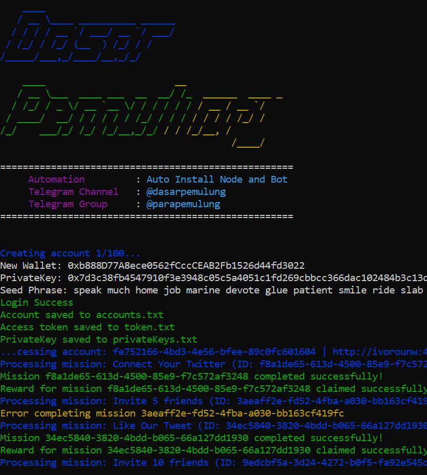

# AIDA-REFF
Automation Refferal for aida



## Main Features

- Automatic Refferal

### Setup Instructions

#### RUN WITH NEW WALLET! DWYOR!!!

1. Clone Code
   ```sh
   git clone https://github.com/jeripangestu/AIDA-REFF.git
   ```
2. Navigate to the project directory:
   ```sh
   cd AIDA-REFF
   ```
3. Input your refferal to `config.js` and input your proxy to `proxy.txt`
4. Install dependencies:
   ```sh
   npm install
   ```
5. Run the bot:
   ```sh
   node autoref.js
   ```


### Notes
- Ensure you have a working proxy for the multi account feature.
- Always keep your private key secure.
- Use this bot responsibly. The author is not responsible for any potential losses.

### Contributing
If you would like to contribute to this project, please open a Pull Request or Issue in this repository.

### License
This project is licensed under the MIT License.

Made with ❤️ by Jeri Tamvan. If you like this project, don't forget to give it a ⭐ on GitHub!

Join Telegram Channel
[Telegram Channel](https://t.me/diskusiparapemulung)

